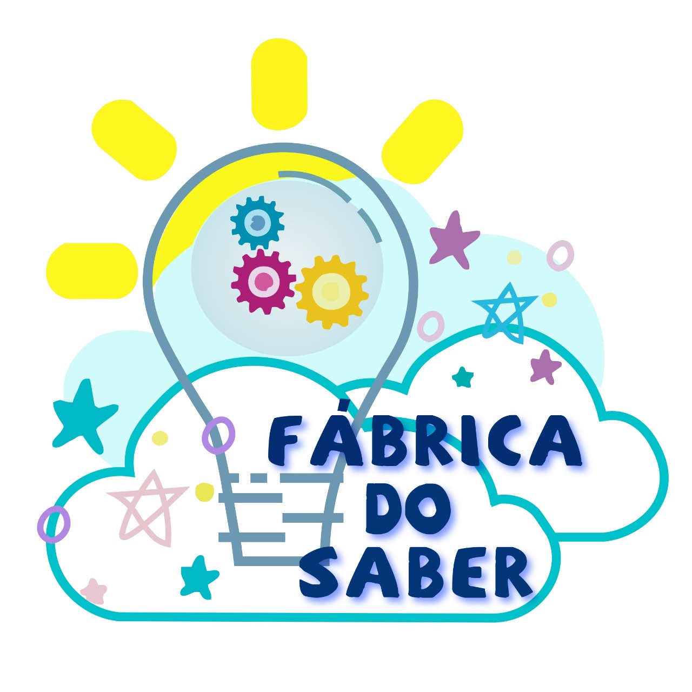

<hr>
<br>
<h3 align="center">

</h3>
<br>
<p align="center">
 <a href="#-sKanboo">Sobre</a> •
 <a href="#-integrantes">Integrantes</a> • 
 <a href="#-professor">Professores</a> • 
 <a href="#-tecnologias">Tecnologias</a> • 
 <a href="#-instruções-de-utilização">Instruções de Utilização</a>  
</p>

# 📝 Fábrica do Saber

A Creche Escola Fábrica do Saber é uma instituição privada de Educação Infantil e Ensino Fundamental I, acolhendo
crianças a partir de 1 ano e 6 meses. O seu propósito é proporcionar educação de excelência, visando à igualdade de
oportunidades aos seus alunos.

Localizada na cidade de Livramento, Centro - BA, seu horário de funcionamento é de 07h30min as 11h30min (matutino) e
13h30min as 17h30min (vespertino) para Educação Infantil; 07h15min as 11h40min e 13h30min as 17h30min para Ensino
Fundamental. Além disso, a escola oferece também período integral, englobando ambos. Durante as férias, realizamos
creches de férias para alunos internos e externos. A escola utiliza
o [Instagram](https://www.instagram.com/escolafabricadosaber/) para divulgar seus serviços e telefones de contato para a
Neta Souza (Diretora) ou Irene Soares (Coordenadora).

Atualmente, os processos de cadastro e manutenção de registros de alunos e professores são feitos manualmente em
cadernos. O controle financeiro, incluindo entradas e saídas, ocorre em planilhas no Microsoft Word. Toda documentação é
mantida fisicamente, exigindo espaço e atenção. A complexidade cresce com alunos, especialmente os neurodiversos,
demandando considerações especiais nos formulários. A emissão de boletos é feita de forma manual, consumindo tempo e
recursos significativos.

## 🤜 Integrantes

- [Guilherme Lage da Costa](https://github.com/guilhermelcosta)
- [João Gabriel Perez Monteiro](https://github.com/JoaoGperez)
- [Lucas Cabral Soares](https://github.com/lcsoares2022)
- [Maria Eduarda Amaral Muniz](https://github.com/duda-amaral)
- [Vítor Lagares Stahlberg](https://github.com/VitorLS0)

## 👨‍💻 Professores

- Eveline Alonso Veloso
- Juliana Amaral Baroni de Carvalho

## 🚀 Tecnologias

- Frontend:

    - [Angular](https://angular.io/)
    - [Bootstrap Angular](https://ng-bootstrap.github.io/#/home)
    - [Chart.js](https://www.chartjs.org/)
    - [FontAwesome](https://fontawesome.com/)
    - [JavaScript](https://www.javascript.com/)
    - [Typescript](https://www.typescriptlang.org/)

- Backend

    - [Java](https://www.java.com/pt-BR/)
    - [Lombok](https://projectlombok.org/)
    - [Spring Boot](https://spring.io/projects/spring-boot)
    - [Spring Security](https://spring.io/projects/spring-security)

- Database:

    - [MySQL](https://www.mysql.com/)
    - [HeideSql](https://www.heidisql.com/)

---

## 💻 Instruções de utilização

**Passo 01: clone o repositório**

`$ git clone https://github.com/ICEI-PUC-Minas-PPLES-TI/plf-es-2023-2-ti3-6653100-fabrica-do-saber`

**Passo 02: instalar ANGULAR via CLI**

A instalação do Angular CLI pode ser acessada [aqui](https://angular.io/cli).

`npm install -g @angular/cli`

**Passo 03: iniciar front-end via linha de comando**

- Passo 3.1: acesse a pasta clonada no **Passo 01** pelo CMD: `cd plf-es-2023-2-ti3-6653100-fabrica-do-saber`;
- Passo 3.2: acesse a pasta front-end pelo CMD: `cd Codigo/front-end/`;
- Passo 3.3: iniciar aplicação frontend: `npm start`

A aplicação vai estar rodando em <http://localhost:4200/>.

**Passo 04: iniciar back-end via linha de comando**

- Passo 4.1: acesse a pasta clonada no **Passo 01** pelo CMD: `cd plf-es-2023-2-ti3-6653100-fabrica-do-saber`;
- Passo 4.2: acesse a pasta back-end pelo CMD: `cd Codigo/back-end/`;
- Passo 4.3: iniciar aplicação frontend: `mvn spring-boot:run`

A aplicação vai estar rodando em <http://localhost:8080/>.

**Usuário de teste**

```
nome: administrador
email: admin@email.com
senha: admin123456
```

## Histórico de versões

- 1.0.0
    - Consolidação da versão final do código.
